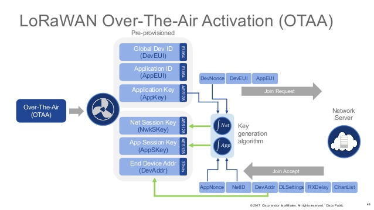

# SmartZG powered by Radiona

## LoRa
  ### LoRa is one of LPWAN Low Power Wide Area Network
  
LoRa is IP block that describes modulation LoRa PHY

	
Lora is Proprietary modulation :(

Chirp spread spectrum (helps to get signal from noise better)

LoRa works great in a noisy environment

	[x] Low transmit power (25mW)
	[x] With realy low power (40mA TX, 10mA RX)
	[x] In sleep, chip is using under 1uA
	[x] Low data rate
	[x] High range
	[x] Great battery life

Nodes (or single chanel gateway)

	[x] SX Chips from Semtech for different frequencies
	[x]  EU uses 868MHz Band SX1276(433Mhz also an option with SX1278)

Gateway SX1301/SX1308 for gateway

	[x] Can receive 8 bands at the same time
	[x] Has better sensitivity

868MHz has Airtime limits

Chips are SPI controlled
868 is a license-free band :)
125kHz bandwidth

Check gr-LoRa on git

	[x] https://github.com/BastilleResearch/gr-lora

## LoRaWAN
### LoRaWAN is a media access control (MAC) protocol for wide area networks. It is designed to allow low-powered devices to communicate with Internet-connected applications over the long range wireless connections.
https://stackforce.github.io/LoRaMac-doc/group___l_o_r_a_m_a_c.html

	[x] Encrypted (AES-128)
	[x] Half-Duplex communication - transmission of data in just one direction at a time (walkie-talkie) 

ISM bands 915 US 868 in EU

	- In EU you can send only 1% of the time on some frequencies 0.1%
	- One band 10% of the time
	- 1% of time is just 36 seconds in one hour

Time spendt on air depends of SF and message lenght
Here goes great picture of AIR time

Protocol is supporting 3 classes

	- Class A
        	-Sends Opens RX1 Opens RX2 Got to sleep
    	- Class B 
        	- Sends and receives in adjusted time slots
    	- Class C 
        	- Sends Opens RX1 waits with opened RX2

Gateway has same airtime limits as the node - ( downlink depends on band )

Sends back message on same frequency, message has arrived RX1, or on special frequency RX2
    
Two way for node to attach to a network
        
Two keys, one for network server and one for data (application)

        - OTAA
          - Handshaking
           - Device sends request
           - Gateway calculates the session key
           - Node calculates session keys
             - Note that no key is sent by node nor by gw
           - Gateway sends accept (settings) encrypted with new keys
	   
  
	 
        - ABP Authorisation by personalisation
          - You just set the session key on both sides (keys never change so it is less secure)
        
LoRa is not for a lot of data, and not for time-critical data

Listen Before Talk (feature of some new gateways)

	- The Listen Before Talk (LBT) protocol makes it possible for multiple users to share the same channel. 
        - When LBT is enabled, the device continuously monitors channels so as to transmit only when a channel is not in use.

Newest MAC supports repeaters

Gateway is just Forwarder  just forwarding messages from NODE <> Network

	- Packet forwarder - runs on gateway

Network architecture
            

Complete opensource solution on your servers

	[x] Gateway bridge
        [x] Network server broker
        [x] Application server broker

or use TTN - https://www.thethingsnetwork.org/
v3 should be easier to deploy on your servers

Remember LoRa is all about compromise

## TTNZagreb by radiona (SmartZG)

Radiona had two workshops for now
 
	- Build your GW
	- All about nodes - mapping the city

Coverage of our gateways

	- TTN mapper (not opensource)
        - check lemilica.com for open source solution

Use case
    
	- IRNAS has few great ones
          - Count penguins
            - power on
            - take pic
            - OpenCV count penguins
            - lora send no of penguins
            - power off
        - Pit stop for turtles
        - Trap for poachers
    	- Birdhouse
        	- Bird in - temp
    	- Intrudes alarm on some distant place - or boat...
    	- Public scale
        	- On exibition - visit us @
    	- Pager
    	- GPS for pets
    	- Polution detector
        	- If something bad detected send a warning
    	- Agriculture
    	- Distant plant soil moisture

So many other

Warning:
    Do not put your GW near a working chimney
